# saldo

## Screenshoot

1. **Tampilan Login**
   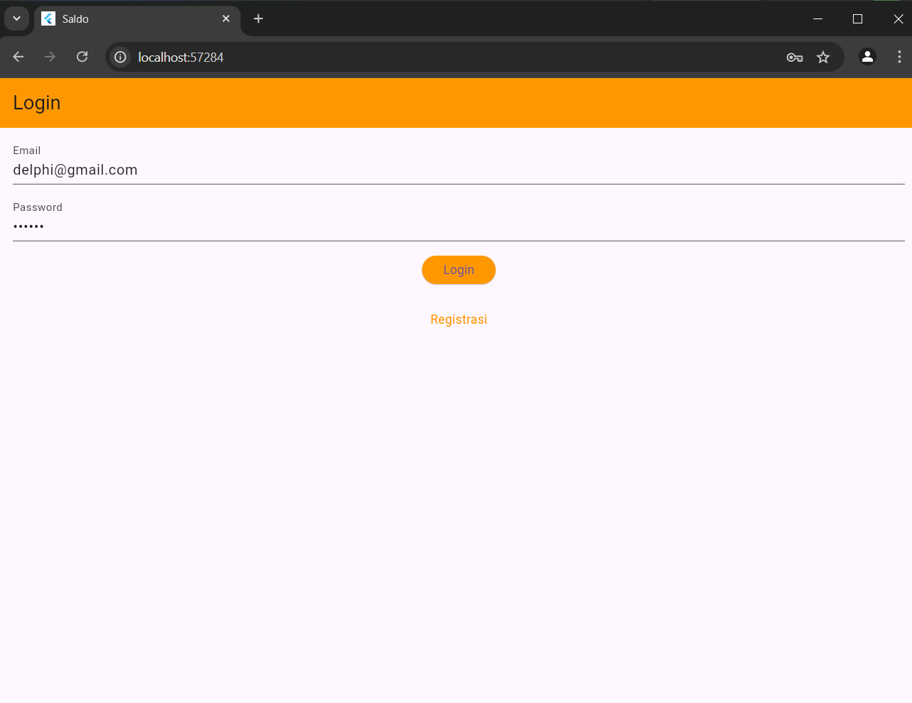
2. **Tampilan Registrasi**
   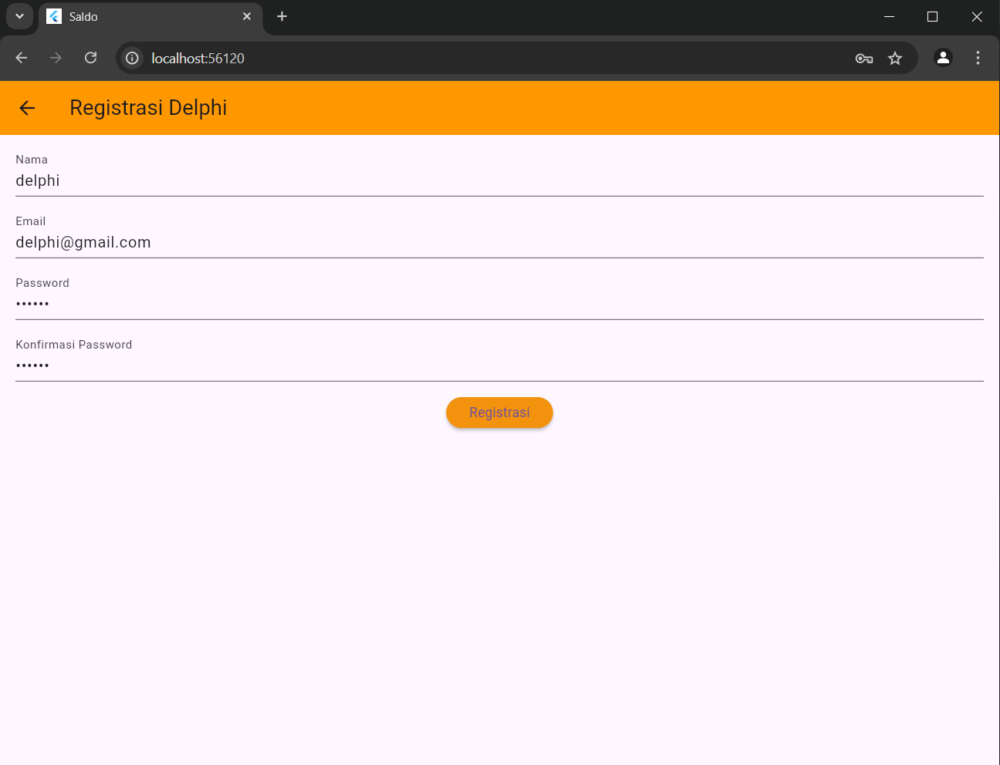
3. **Tampilan List Saldo**
   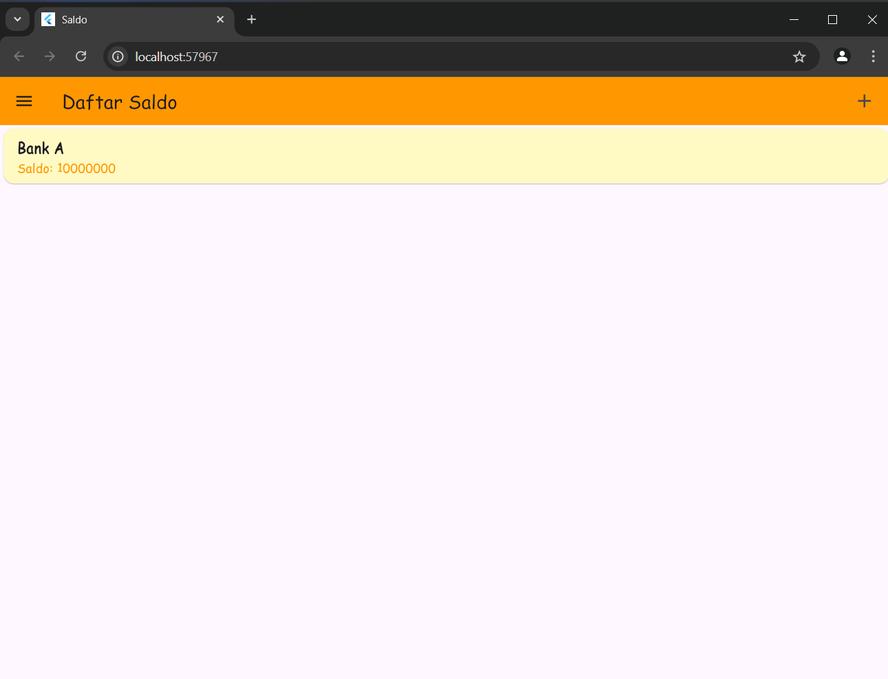
4. **Tampilan Detail Saldo**
   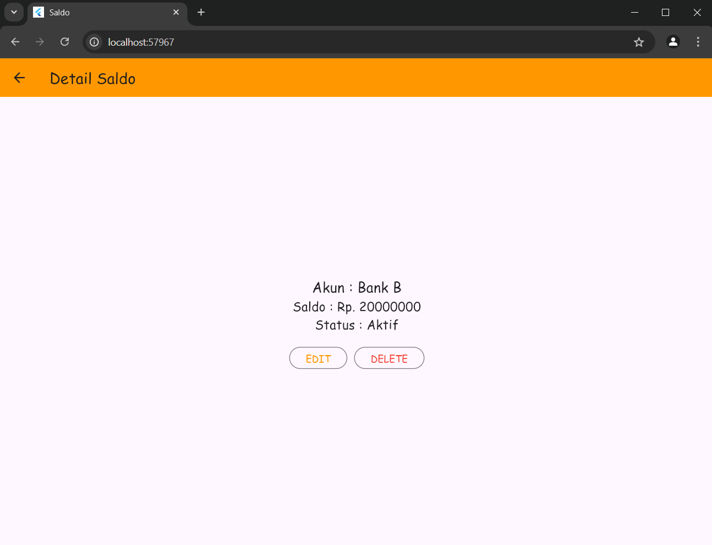
5. **Tampilan Ubah Saldo**
   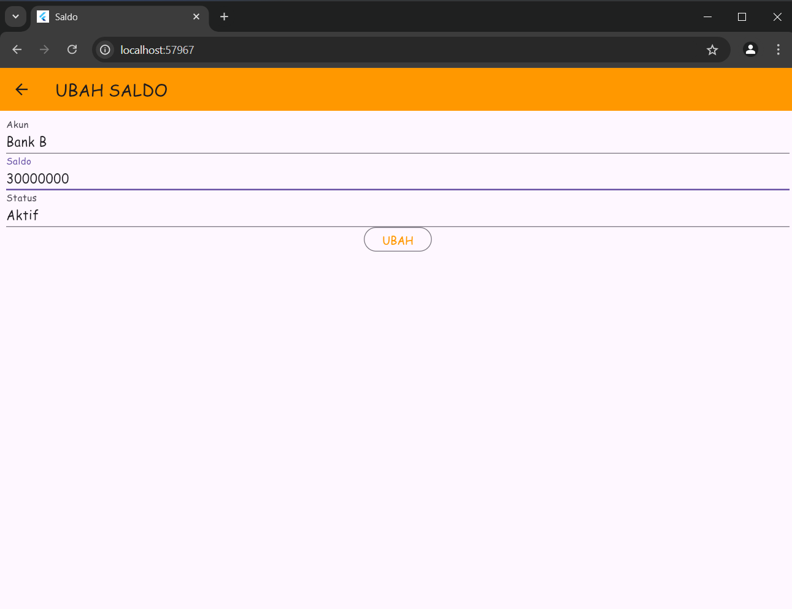
6. **Tampilan Tambah Saldo**
   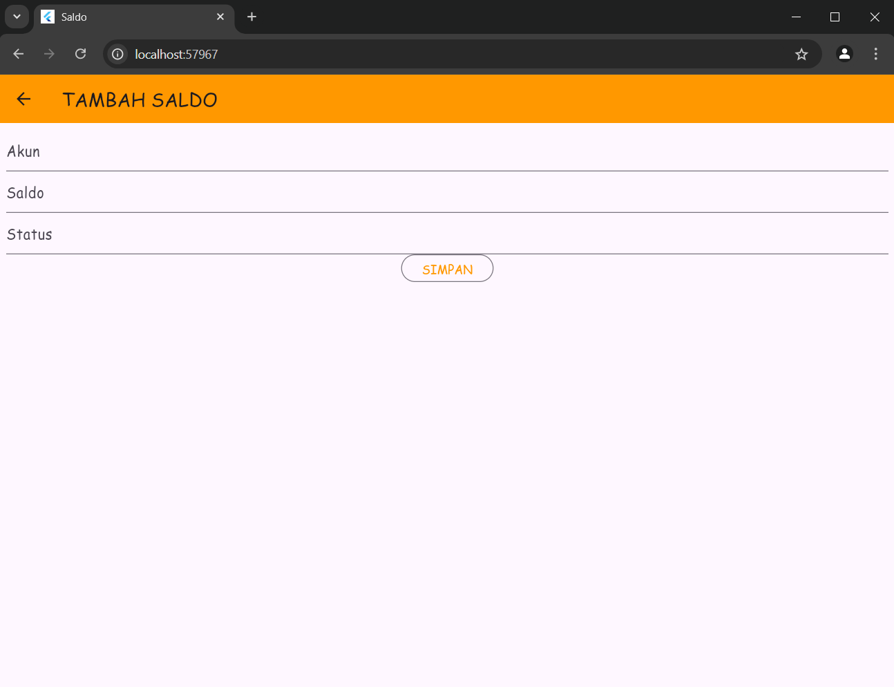
7. **Tampilan Logout**
   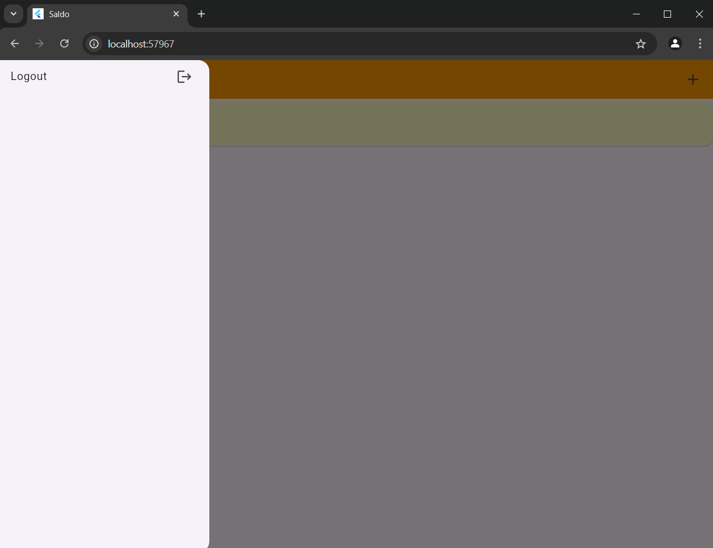

# Penjelasan Proses Aplikasi
1. **Proses Registrasi**
   a. Input data
   
   Pada proses ini, pengguna diharuskan untuk mengisi nama, email, password, serta konfirmasi password pada form yang tersedia. Data ini kemudian dikirim ke server lalu disimpan di database.
   Berikut kode yang bertugas untuk mengirim data ke API di file registrasi_page.dart:
   RegistrasiBloc.registrasi(
   nama: \_namaTextboxController.text,
   email: \_emailTextboxController.text,
   password: \_passwordTextboxController.text)
   b. Pop-up Sukses Registrasi
   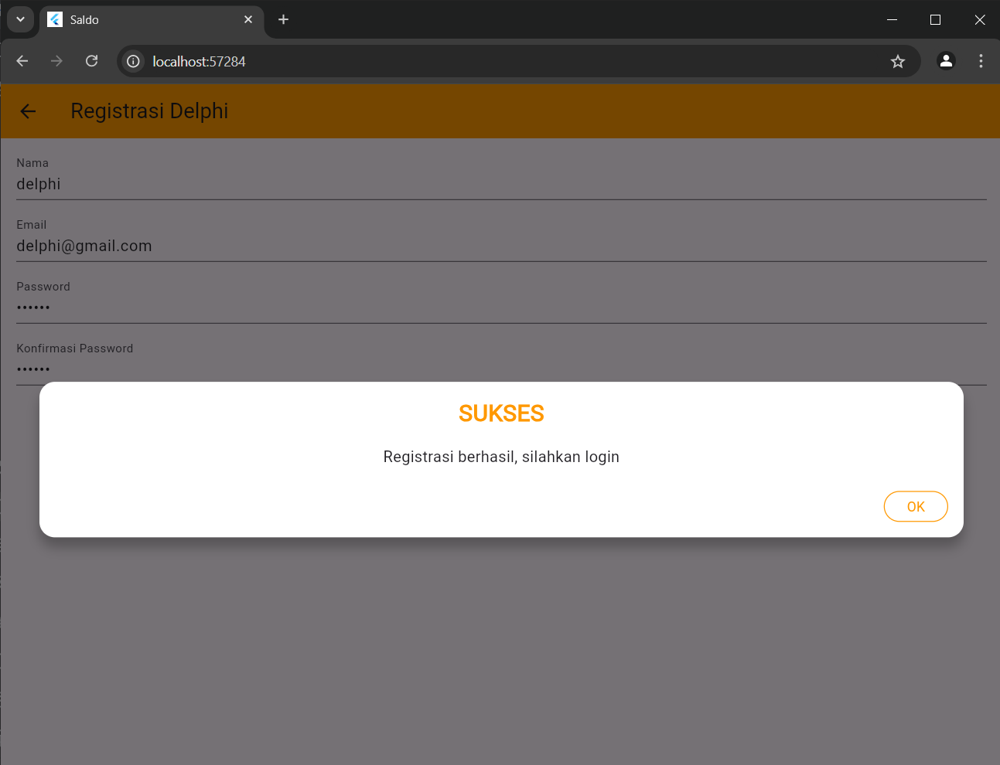
   Setelah berhasil mendaftar, pop up ini akan muncul lalu pengguna diarahkan untuk login.
   showDialog(
   context: context,
   barrierDismissible: false,
   builder: (BuildContext context) => SuccessDialog(
   description: "Registrasi berhasil, silahkan login",
   okClick: () {
   Navigator.pop(context);
   },
   ),
   );
   c. Pop up Gagal Registrasi
   Ketika pengguna gagal melakukan registrasi, maka akan muncul pop up seperti pada gambar
   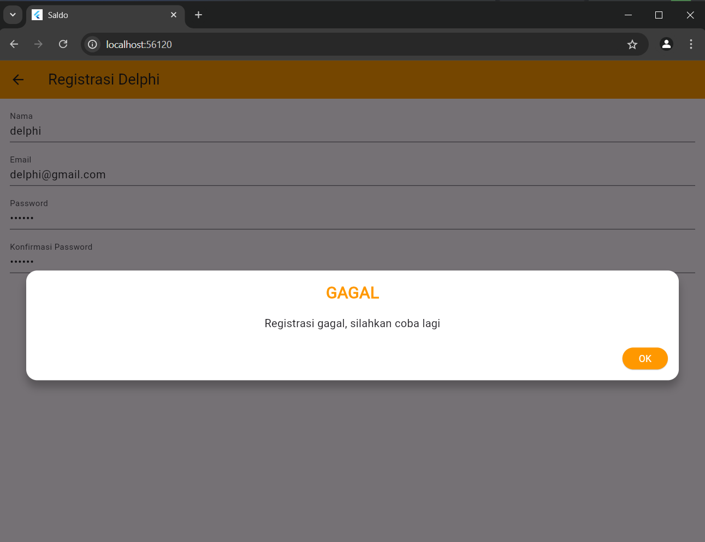
   showDialog(
   context: context,
   barrierDismissible: false,
   builder: (BuildContext context) => const WarningDialog(
   description: "Registrasi gagal, silahkan coba lagi",
   ),
   );

2. **Proses Login**
   a. Input Data
   
   Pengguna diharuskan untuk mengisi email dan password sesuai dengan data yang dimasukkan saat registrasi. Data ini dikirim ke API untuk proses autentikasi:
   Berikut kodenya yang ada di dalam file login_page.dart:
   LoginBloc.login(
   email: \_emailTextboxController.text,
   password: \_passwordTextboxController.text)

   b. Berhasil Login
   Jika login berhasil, pengguna akan diarahkan ke halaman daftar saldo
   Navigator.pushReplacement(context,
   MaterialPageRoute(builder: (context) => const SaldoPage()));
   
   c. Gagal Login
   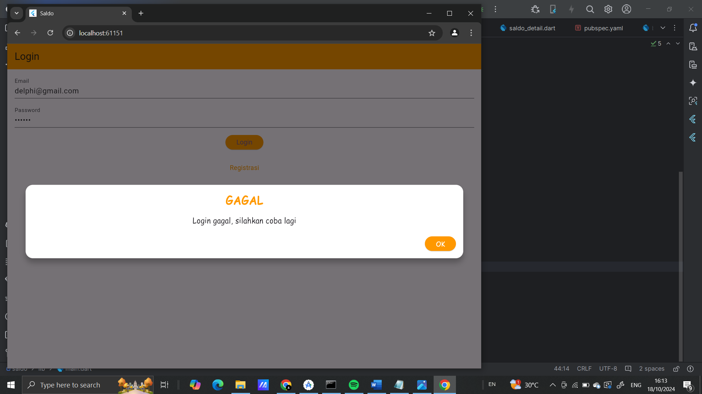
   Jika login tidak berhasil, maka akan muncul pop up yang berasal dari kode berikut:
   showDialog(
   context: context,
   barrierDismissible: false,
   builder: (BuildContext context) => const WarningDialog(
   description: "Login gagal, silahkan coba lagi",
   ));

3. **Proses Tambah Data Saldo**
   a. Tambah Data Saldo Baru
   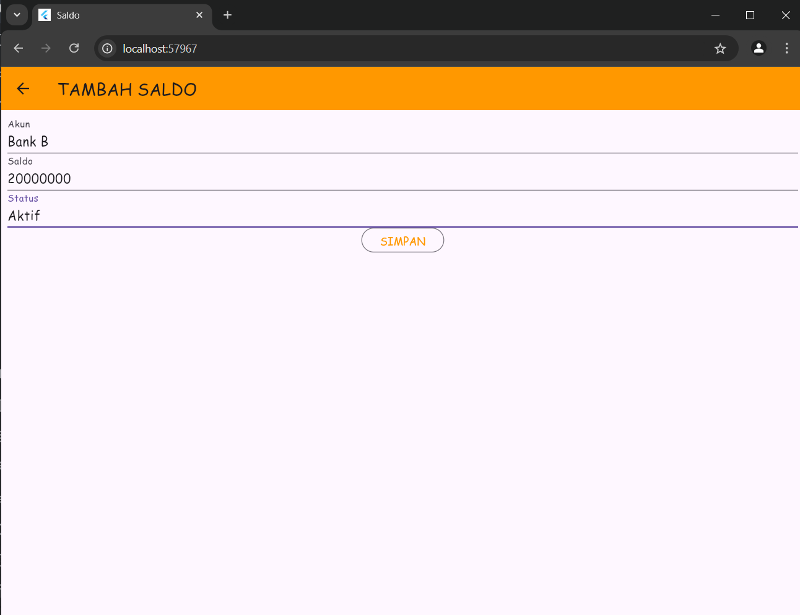
   Pengguna mengisi data data yang dibutuhkan. Data akan dikirim ke server lalu ditambah ke database.
   Balance createBalance = Balance(
   account: _accountTextboxController.text,
   balance: int.parse(_balanceTextboxController.text),
   status: _statusTextboxController.text,
   );

   b. Berhasil Tambah Data
   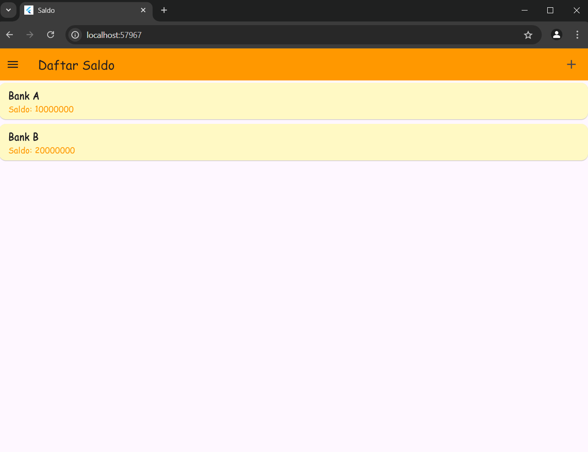
   Data akan ditampilkan di Detail Saldo setelah berhasil ditambahkan
   BalanceBloc.addBalance(balance: createBalance).then((value) {
   Navigator.of(context).push(MaterialPageRoute(
   builder: (BuildContext context) => const SaldoPage()));
   },

4. **Proses Detail Saldo**
   a. Melihat Detail Saldo
   
   Saat pengguna memilih saldo dari daftar, detail saldo akan ditampilkan menggunakan halaman detail:
   Navigator.push(context, MaterialPageRoute(builder: (context) => BalanceDetail(balance: balance)));

5. **Proses Ubah Saldo**
   a. Input Data untuk Ubah Saldo
   
   Balance updateBalance = Balance(
   id: widget.balance!.id!,
   account: _accountTextboxController.text,
   balance: int.parse(_balanceTextboxController.text),
   status: _statusTextboxController.text,
   );

   b. Gagal Ubah Data Saldo
   Gagal mengubah data saldo

6. **Proses Hapus Data**
   a. Konfirmasi Hapus Data
   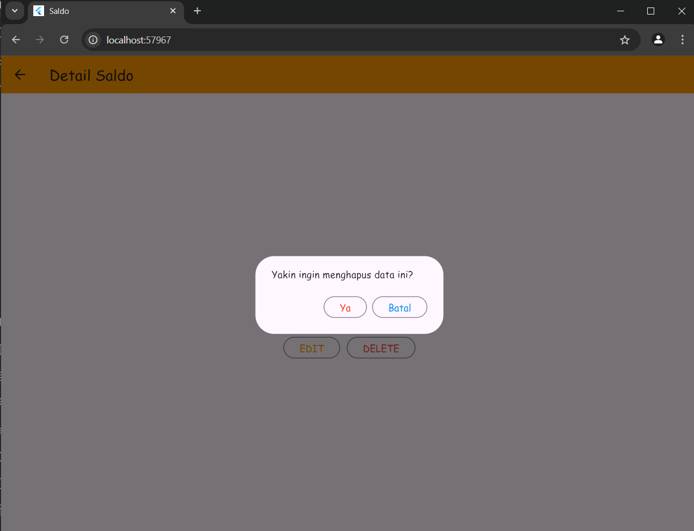
   Saat pengguna mengklik tombol hapus, sebuah dialog konfirmasi akan muncul untuk memastikan apakah pengguna ingin menghapus saldo
   OutlinedButton(
   child: const Text(
   "Ya",
   style: TextStyle(fontFamily: 'Comic Sans MS'),
   ),
   onPressed: () {
   BalanceBloc.deleteBalance(id: (widget.balance!.id!)).then((value) {
   Navigator.of(context).push(MaterialPageRoute(
   builder: (context) => const SaldoPage()));
   }, onError: (error) {
   showDialog(
   context: context,
   builder: (BuildContext context) => const WarningDialog(
   description: "Hapus gagal, silahkan coba lagi",
   ));
   });
   },
   style: OutlinedButton.styleFrom(foregroundColor: Colors.red),
   ),

   b. Berhasil Hapus Data Saldo
   
   Berhasil hapus data saldo Bank B.

7. **Proses Logout**
   a. Tombol Logout
   
   Pengguna dapat logout dari sistem dengan menekan tombol logout. Ini akan menghapus sesi pengguna dan mengarahkan kembali ke halaman login:
   onTap: () async {
   await LogoutBloc.logout().then((value) => {
   Navigator.of(context).pushAndRemoveUntil(
   MaterialPageRoute(
   builder: (context) => const LoginPage()),
   (route) => false)
   });
   },
